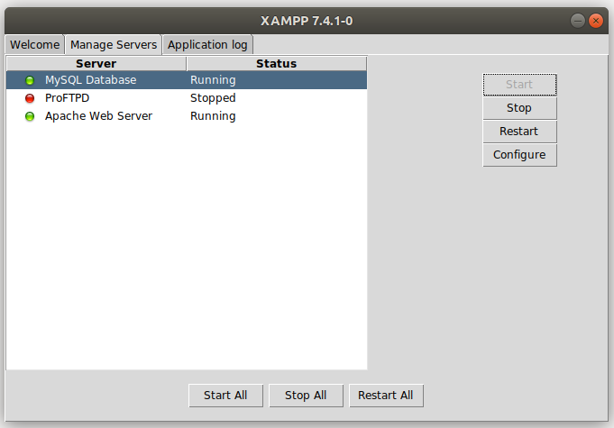
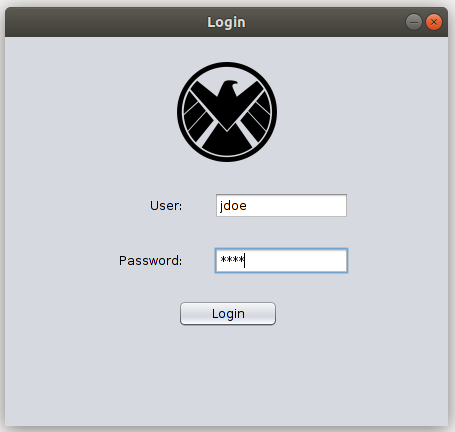

# Authentication App With Java and MySQL

MySQL Java app with login window which connects to a local mysql database to see if the login can be concluded or not.

# About this Project

This project's goal is to create a simple login app on which the user can enter the *username* and *password*. If *username* and *password* are in the database, then a message dialog will say success; else, another message dialog will pop up for failure.

# Getting Started

**Prerequisites**

To run this project, you'll need to have a basic environment to run a Java, MySQL App.

**Installing**

Cloning the Repository

    $ git clone https://github.com/awcasella/Simple-Login-Java-MySQL.git

    $ cd Simple-Login-Java-MySQL
  
Installation of XAMPP for MySQL and Java

Run project
Open XAMPP and start MySQL Database and Apache Web Server. 

  

After that, open the terminal and start MySQL

    $ mysql -u root -p

Configure local database to be connected by our app:

    > create database if not exists login;
    
    > create table if not exists login(
    username VARCHAR(15) PRIMARY KEY,
    password VARCHAR(15) NOT NULL,
    email VARCHAR(25) NOT NULL,
    fname VARCHAR(15) NOT NULL,
    lname VARCHAR(15) NOT NULL,
    );
    

Open NetBeans (or other IDE) and run the project. Make sure the file MySQLTest.java is the main file of the project.

